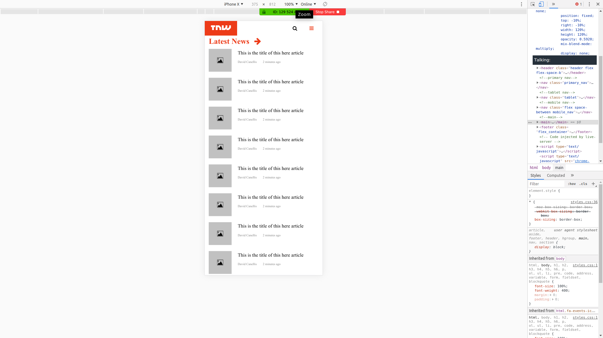
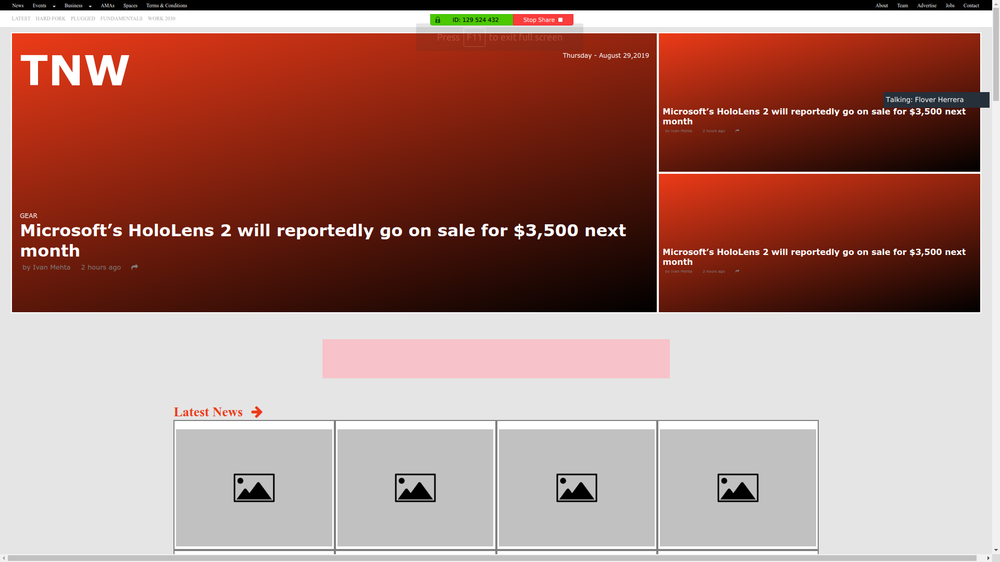
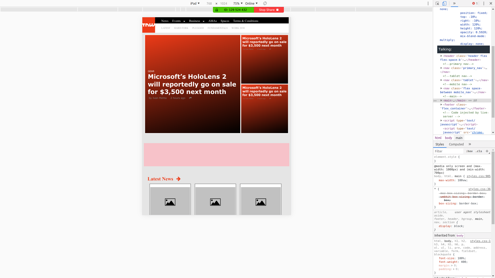

# responsive_design

This is the sixth project of the Main HTML/CSS curriculum at [Microverse](https://www.microverse.org/) - @microverseinc

* The goal was to recreate The Next Web's main page 
* The project was completed using html and css 

#### [Assignment link](https://www.theodinproject.com/courses/html5-and-css3/lessons/responsive-design)

#### [Live Version](https://raw.githack.com/flov3rh/responsive_design/master/index.html)

#### Screenshots

#### Authors

* [@Ed](https://github.com/edwinmoradian90)
* [@Flover](https://github.com/flov3rh)
